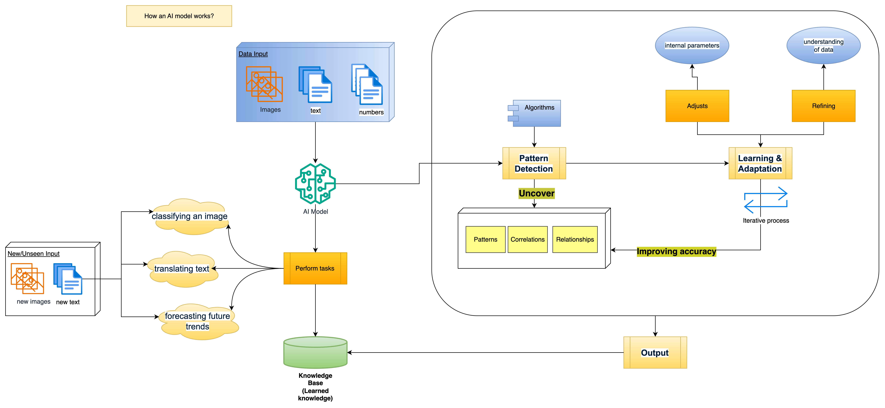

# Machine Learning - W38

## Basic Concepts

### 1. What is an AI Model?

An AI Model is **trained** computer program or software that **learns** to **identify patterns** in **large datasets** and use that **knowledges** to make **predictions**, **classify data**, or **automate decision** _without human intervention_.

For example, teaching an AI model to identify animals, after seeing many examples, then the AI model can recognize a new animal it hasn't encounter before.

AI models are trained using **algorithm** and **statistical techniques** to perform specific tasks, such as **image recognition**, **natural language processing**, and **predictive model**.

### 2. How an AI Model Works?

**1. Data Input**

- The model receives a large quantities of data (e.g, images, text, numbers)

**2. Pattern Detection**

- The model using algorithms, processing the input data to **uncover** **patterns**, **correlations** and **relationships** within it.

**3. Learning & Adaptation**

- The model **adjusts** it **internal parameters**, **refining** its **understanding of data** and improve its **accuracy** over time **through** an **iterative process**

**4. Output**

- Once **trained**, the model can apply its **learned knowledge** to **new, unseen data** to **perform a task**, such as classifying an image, translating text, or forecasting future trends.

### 3. Examples

1. Image and Video Recognition:

- AI models that can identify objects and people in images and videos.

2. Natural Language Processing (NLP):

- Models that enable computers to understand, interpret, and generate human language, used in chatbots and translation services.

3. Recommender Systems:

- Platforms that use AI to suggest relevant products or content based on user preferences.

4. Predictive Modeling:

- AI models that forecast future outcomes, such as predicting sales or identifying potential equipment failures.
